# WIUT Hackathon 2026 · FinTech Track — Elimination Round
## EDA → Model Master TODO · Alert escalation (ROC-AUC)

| | |
|---|---|
| **Your role** | EDA + model training (teammates: website, QA/submission) |
| **Metric** | ROC-AUC on the hidden test set · **one official submission only** |
| **Deliverables** | `team_<TEAM_ID>.csv` · public EDA website URL · one reproducible notebook |
| **Team ID** | reference `486052EC` → `team_486052EC.csv` (**confirm with the organisers** that the reference is the TEAM_ID) |
| **Hard deadline** | Sun 27 Sep 2026, 23:59 (Tashkent) |
| **Internal deadlines** | Feature freeze Sat 26 Sep 22:00 · Holdout check Sun 27 Sep 09:00 · Submit Sun 27 Sep 18:00 |
| **Status** | Phase 0 ✅ · Phase 1 ✅ · Phase 1 review applied (Fri 25 Sep) · **next: Phase 2** |

> **Rendering:** diagrams are Mermaid. They render on GitHub, in VS Code (extension "Markdown Preview Mermaid Support"), or at https://mermaid.live
>
> **Code:** Appendix A (A06–A18) was rewritten after the Phase 1 review. It was tested end-to-end on synthetic data with the competition schema (pandas 3.0.6, LightGBM 4.7.0, CatBoost 1.2.10), on top of the notebook's own Phase 0–1 cells, and two clean runs produced identical submission and artifact md5s. The feature builders were also timed on the real transactions without touching labels: about 20 s for the parts and all 286 features on train + test, 2.8 GB peak memory.

---

## What changed after the Phase 1 review

Source: `phase1_required_changes_with_holdout.md` (§ numbers below refer to it). Nothing in Phase 0 or Phase 1 is redone.

| Area | Before | Now | Where |
|---|---|---|---|
| Validation | Stratified 5-fold on all train, 10% lockbox if ≥ 5k alerts | Stratified **80% dev / 20% confirmation holdout**. One fixed 5-fold StratifiedKFold inside dev for every decision; holdout scored **once** after the freeze (§1) | Phase 2, D7 |
| Final model | Average of the CV fold models, no refit | After the holdout check, the frozen config is refit with **5-fold on all 14,000 labels**, test predictions averaged over folds (§1) | 6.3 |
| Terminology | "pre-alert cluster" | **trigger window / pre-alert trigger burst** (lag ≤ 1) vs **background** (lag ≥ 2) | §3 glossary |
| Windows | Generic 1/3/7/14/30/90 days | Trigger + background windows (2–7, 2–30, 2–90, 2–180) and the change between them (§2) | 4.1–4.3, D8 |
| Trigger features | – | Trigger level (§3), **trigger vs background (the stronger hypothesis, §4)**, compression (§5). All three are to be tested, none is assumed | 3.4, 4.2, 4.3, 4.6 |
| Hour / weekday | night and weekend shares, hour × weekday heatmap | Removed; F10 becomes trigger compression (§6) | 3.9, 4 |
| Post-alert branch | Strict pre-alert vs all transactions, two pipelines | Removed: there are 0 post-alert rows, so there is one pipeline (§7) | 1.7 |
| Amounts | Global p95/p99, `exp(index)` "restores money", round/repeated amounts | Channel-relative p95/p99 and z per direction × type (§8); `exp(index)` experimental, P2 (§9); exact repeats removed, structuring = *similar* amounts (§10) | 3.8, 4.4, 4.5 |
| Linkage | Pseudo-customers, group CV, linkage features | Removed; the check stays in the notebook as an integrity check (§11) | 1.10 |
| Constant audit outputs | `has_history`, `n_post_signal_tx`, duplicate count went into the model | Never model features; constant columns are dropped automatically (§12) | 4.14 |
| Date context | Calendar + raw-date caution | `signal_id`, row order and raw date are never features; `alerts_same_day` is testable (P2); calendar is P2 (§13) | 2.6, 2.7 |
| Adversarial validation | Phase 4 drift screen | Phase 2 confirmation on baseline features, re-run on the final set (§1, §16) | 2.5, 4.12 |
| Seeds | 3 seeds in every run | 1 seed while experimenting; extra seeds only once the solution is largely frozen (§1) | 5.4 |

**Additions that are not in the review** (driven by the data or by method; flagged for team sign-off):

- **Burst core for timing features.** Within `lag_days <= 1`, 7,200 of 14,000 train alerts also carry at least one ordinary background transaction. That pushes the median trigger duration from 2.8 min (last hour only) to 135 min. Compression and dormancy features therefore use `secs_before <= 3600` (`BURST_SECS`); composition features keep the review's `lag_days <= 1`. Checked in 3.5.
- **No coefficient of variation on the raw index.** The index is centred near 0 (mean −0.13), so std / mean blows up. Structuring uses std, IQR and range of cash-in amounts instead (CV is fine only on `exp(index)`, which is P2).
- **`recency_days` and `history_span_days` are dropped.** With a common 180-day lookback window and a trigger at lag ≤ 1 in 99% of alerts, they are near-constant by construction.
- **Pre-registered holdout warning rule.** A drop of dev OOF − holdout AUC ≥ 2 bootstrap SE (≈ 0.025 at 481 holdout positives) raises a warning; the rule is written in `decisions.md` before the one scoring. It is a warning threshold, not a formal proof that the model generalizes: passing it only means the check found no sign of selection overfit.
- **Split before any further label-based EDA.** The 80/20 split is task 2.2, straight after the target count, so every later by-class view, screen and error analysis runs on dev only.
- **No net flow in index units.** The index is not money (§9), so flow uses counts, shares, timing and channel-relative sizes.

---

## Contents

0. How to use this file
1. What wins this round
2. Business context: how an alert becomes a label
3. Data model & glossary
4. Master plan (pipeline, timeline, priorities)
5. Phase 0 — Setup ✅
6. Phase 1 — Data audit & integrity ✅
7. Phase 2 — Target, split & validation design
8. Phase 3 — Behavioral EDA (dev set only)
9. Phase 4 — EDA-driven features
10. Phase 5 — Modeling for max AUC
11. Phase 6 — Freeze, confirm, final fit, submit
12. Edge-case register
13. Banking-grade practices
14. Figure pack & website mapping
15. Team hand-offs
16. Final notebook layout
17. Anti-patterns
18. References
- Appendix A — Tested code toolkit (A06–A18; A01–A05 done in the notebook)
- Appendix B — Decision log template

---

## 0. How to use this file

**Priority:** 🔴 P0 = affects score or validity · 🟠 P1 = high value · 🟢 P2 = only if ahead of schedule. Phase 4 priorities follow the review's §17 list one to one.

**Every task ends in** a figure (F-id), a feature, a logged decision, or "no effect". "No effect" is a finding too, so log it.

**Stop rule:** if you are more than 2h behind the timeline, drop all 🟢 and half of the 🟠.

**Golden rules**

1. **One submission means local CV is your only leaderboard.** The validation design is frozen in Phase 2: every decision uses the fixed 5-fold CV on the 80% dev set. Never choose a model from one lucky fold.
2. **The holdout stays closed.** No plots, screens, error analysis, "quick checks" or model comparison on the 20% holdout. It is scored once, after features, preprocessing, models, hyperparameters and blend are frozen.
3. **EDA exists to move AUC.** For every plot, write *What we see → So what → Action*. If a plot changes no decision, move on.
4. **One `build_features()` for train and test.** Unsupervised statistics (channel thresholds, alerts per day) may use train+test transactions. Anything that uses the label is computed on dev, inside CV folds.
5. **Left-join features onto the signal tables.** This data has no alerts without transactions, but the pipeline must still survive them.
6. **Stay clean.** No external copies of labels, no hunting for the source dataset, no ID or row-order tricks. They are prohibited or will fail verification.
7. **Reproducible by construction.** Seeds, relative paths, one notebook. Restart & Run All must produce the same CSV hash.

---

## 1. What wins this round

Ranking is by ROC-AUC. The gate is that all deliverables exist and pass verification. Priorities, in order:

1. **A valid, reproducible CSV exists early (end of Phase 2, Fri 25).** This protects you from the worst case.
2. **AUC comes mostly from how you summarize each alert's history**, plus trustworthy validation. Much less comes from tuning.
3. **The website shows your reasoning:** data → patterns → features → result. Your figure pack is its raw material.

| Lever (expected impact, high → low) | Why it works for alert triage | Where |
|---|---|---|
| Trigger vs the alert's own background (ratios, deltas) | Every alert has a burst, so its size alone separates little; how abnormal it is relative to the customer's normal is the analyst's real question | 4.3 |
| Standard windows × direction × type | Cash and cross-border are classic risk channels; windows separate the recent from the old | 4.1 |
| Channel-relative amounts | Types sit on different parts of the index scale, so "large" only means something within a channel | 4.4 |
| Flow and pass-through timing | Fast in→out flows are a sign of layering | 4.5 |
| Validation that matches the test split (frozen) | With one shot, picking the wrong model is fatal | Phase 2 |
| Burst compression, rhythm, sequences | Same count, different timing; plausible but unproven | 4.6–4.8 |
| Model diversity (LightGBM + CatBoost, seeds at the end) | Small but reliable gain | Phase 5 |
| Hyperparameter tuning | Usually the smallest gain, so do it last | Phase 5 |

**AUC facts to exploit**

- AUC only cares about ranking. Calibration is irrelevant, resampling rarely helps, and blends should be rank averages.
- Also report **Gini = 2·AUC − 1**, the bank-standard name for the same quantity, and **KS**.

---

## 2. Business context: how an alert becomes a label

**D2 — Alert lifecycle**

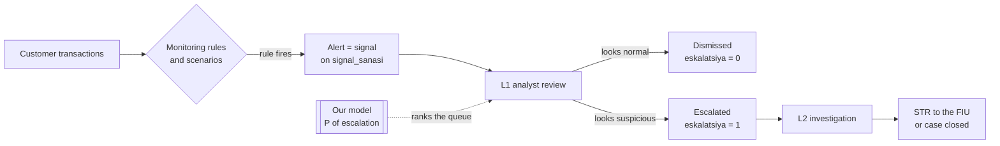

- **The label is an analyst's decision, not proven laundering.** It reflects three things: (a) what the rule saw, (b) recent behavior compared with the customer's normal, and (c) human factors such as workload and policy changes over time. All three are EDA questions.
- **The data mirrors the analyst's view.** Every history ends with a dense **trigger burst** (median 31 transactions in the last ~3 minutes before the alert date starts), which is the activity the rule saw. The **background** across the 180-day lookback window before it is the customer's normal. The main behavioral hypothesis to test is (b): how different is the trigger from the alert's own background? Its structure is proven, its link to escalation is not yet.
- **Every alert already passed a rule.** Dismissed alerts are near-misses, not "normal customers", so expect subtle differences. The early class checks in the review (§14) suggest that trigger size and basic trigger mix differ only slightly between classes. Ratios and context usually beat raw volume.
- **Framing for the website:** published estimates put the false-positive rate of rule-based monitoring around 95–98% (Feedzai paper in §18). A model that ranks the alert queue saves analyst time.
- **Limitations to state on the website.** Compared with a real bank, the data has no KYC or risk rating, no counterparties, no balances, no rule or scenario code, and no customer ID. No transaction row appears under more than one alert, so prior-alert history cannot be recovered either: every alert is an independent unit. Amounts are an index with an unknown transform, not money.

---

## 3. Data model & glossary

**D3 — Entity-relationship diagram**

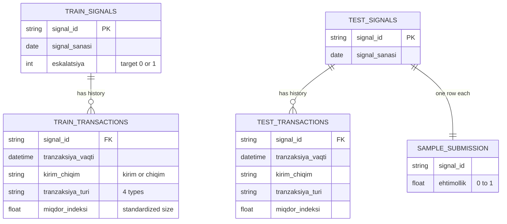

**Grain:** one modeling row per `signal_id`. Transactions are many-to-one. There is no customer ID. Train: 14,000 alerts and 6,987,663 transactions; test: 6,000 alerts and 3,027,575 transactions.

| Uzbek / term | English | Note (Phase 1 result) |
|---|---|---|
| signal | alert | modeling unit |
| signal_sanasi | alert date | date only, ISO `%Y-%m-%d`, 2025-01-01 → 2026-12-31 in train and test |
| eskalatsiya | escalated (target) | 1 = escalated, 0 = dismissed; 2,405 of 14,000 = 17.2% |
| tranzaksiya_vaqti | transaction timestamp | naive, second precision; no daily or weekly rhythm |
| kirim / chiqim | incoming / outgoing | direction; about 3 in 4 transactions are incoming |
| karta | card | lowest amount index |
| bank_otkazmasi | bank transfer | |
| naqd | cash | classic placement channel |
| xalqaro | international / cross-border | classic layering channel; highest amount index |
| miqdor_indeksi | amount index | one global scale, near-normal with a right tail, floor −2.91, capped per type; `VAL = raw` |
| ehtimollik | probability | submission column (a rank-blend score in [0, 1] is valid) |
| `lag_days` | days before the alert | alert date − transaction date; 0 … 180, never negative |
| `secs_before` | seconds before the alert | alert date midnight − timestamp; negative = late on the alert day |
| **trigger window** | pre-alert trigger burst | `lag_days <= 1`; ~8% of rows; 152 train alerts have no burst |
| **burst core** | the burst itself | `secs_before <= 3600`; used for compression and dormancy features |
| **background** | the alert's historical baseline | `lag_days >= 2`, 179 days (lags 2–180) |
| **dev set** | development set | 80% of train, stratified; all decisions |
| **holdout** | confirmation holdout | 20% of train, stratified; scored once after the freeze |

---

## 4. Master plan

**D1 — Pipeline**

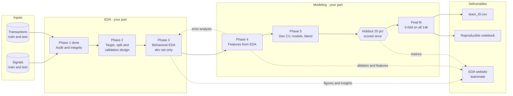

**D4 — Timeline.** Re-planned on Fri 25 after the review; shift the blocks to your availability, but keep the three milestones fixed (freeze, holdout, submit).

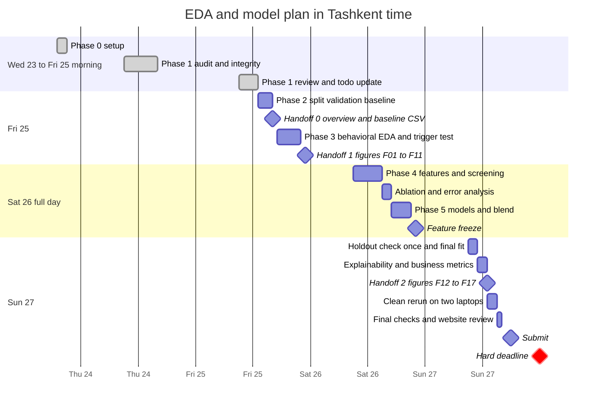

**D5 — Where the AUC is (expected impact vs effort)**

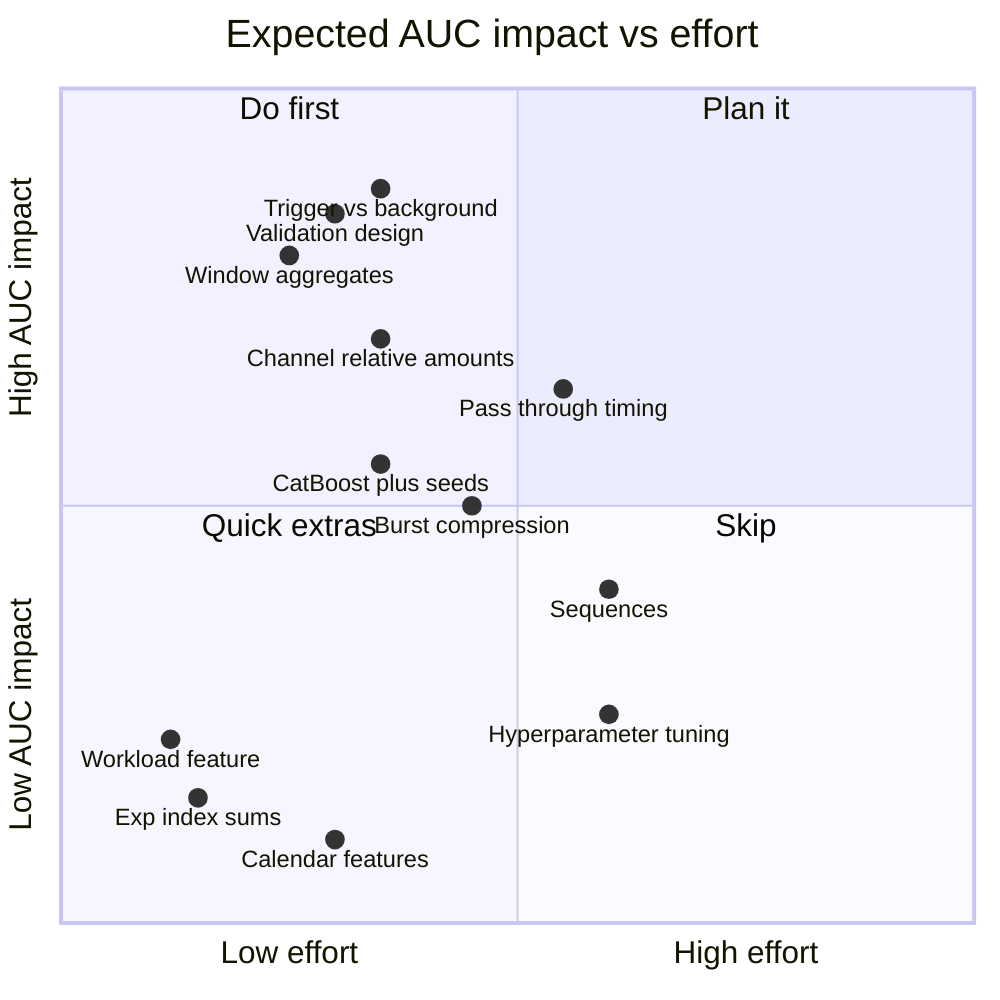

---

## 5. Phase 0 — Setup ✅ (Wed 23)

- [x] 🔴 **0.1 Repo layout**, with `data/` in `.gitignore`. Competition data never goes into a public repo or onto the website.
- [x] 🔴 **0.2 One notebook:** `notebooks/solution.ipynb` holds EDA, model and submission.
- [x] 🔴 **0.3 Pinned `requirements.txt`**, exported from `uv.lock`; versions are shown in the first cell.
- [x] 🔴 **0.4 Setup cell:** imports, `SEED = 42`, `ROOT / DATA_DIR / FIG_DIR / ART_DIR / SUB_DIR`, `FILES` with an existence check.
- [x] 🔴 **0.5 Loaders with explicit parsing:** strict `DATE_FMT = "%Y-%m-%d"`, naive timestamps asserted, categories as `category`.
- [x] 🔴 **0.6 Figure and insight helpers:** `save_fig(fig, fig_id, finding, action)` feeds `INSIGHTS` → `insights.json`.
- [x] 🟠 **0.7 Decision log** `artifacts/decisions.md` exists. `artifacts/cv_log.csv` is created by the first `log_run` in 2.8.
- [ ] 🟢 **0.8 Flags.** Deferred: add `RUN_TUNING = False` only if tuning code lands in Phase 5; anything else is decided at the 6.7 runtime check.

```text
automated-alerts/
├── data/                       # gitignored, exactly as provided
│   ├── training/  train_signals.csv, train_transactions.parquet
│   ├── test/      test_signals.csv,  test_transactions.parquet
│   └── sample_submission.csv
├── notebooks/solution.ipynb    # the ONE submitted notebook
├── figures/                    # F00 ... F17 PNGs -> website
├── artifacts/                  # F00 tables, insights.json, decisions.md, split.csv, cv_log.csv,
│                               # feature_screen.csv, ablation.csv, metrics.json
├── submissions/team_486052EC.csv
├── requirements.txt
└── README.md                   # put data in data/, then Restart & Run All
```

---

## 6. Phase 1 — Data audit & integrity ✅ (Thu 24)

**D6 — Audit outcome** (every branch came out clean)

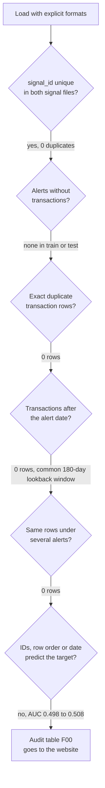

| Task | Result | Consequence for the plan |
|---|---|---|
| [x] 🔴 **1.1 Schema & grain** | 14,000 / 6,000 alerts, `signal_id` unique in both; every column classified (`F00_schema.csv`) | – |
| [x] 🔴 **1.2 Referential integrity** | 0 alerts without transactions, 0 orphans, 0 train/test ID overlap, sample IDs = test IDs (set and count) | Left join kept for robustness only |
| [x] 🔴 **1.3 Categories** | Identical value sets; shares agree within 0.2 pp | No mapping needed |
| [x] 🔴 **1.4 Missing & invalid** | 0 nulls, 0 non-finite amounts, no placeholder dates | – |
| [x] 🔴 **1.5 Duplicates** | 0 exact duplicate rows. Same-second pairs (1.3% of rows) sit almost entirely inside the trigger burst | No keep-vs-dedup branch; duplicate count is constant → not a feature (§12). Same-second → P1 compression (4.6) |
| [x] 🔴 **1.6 Timestamps** | Naive, second precision; hours 0–22 and all weekdays flat (3.8% / 14.3% each); hour 23 = 11.7% because of the burst | **No hour-of-day or weekday features** (§6); timezone irrelevant |
| [x] 🔴 **1.7 Relative time** | Common 180-day lookback window (earliest transaction: median 180 days out, p05 170); 0 rows after the alert date. Burst: ~8% of rows, median 31 per alert, last ~3 min before the alert date starts; 152 alerts have none; 21 carry it just after midnight on the alert day (lag 0) | Strict-vs-all branch removed, one pipeline (§7). Trigger window `lag_days <= 1` covers the off-by-one; boundary refined in 3.5 |
| [x] 🔴 **1.8 Amount forensics** | One global scale (per-alert means spread with sd 0.49 → not per-alert standardized); near-normal, skew 0.63, floor −2.91; means shift by type and direction. Only 4 exact repeats = the per-type caps (card 4.183, cash 4.863, international 6.430, transfer 6.692) | `VAL = raw`; channel-relative thresholds (§8); `exp(index)` experimental, P2 (§9); no round or exact-repeat features (§10); cap-hit flag P2 |
| [x] 🔴 **1.9 ID & row-order artifacts** | ID number, file orders and alert date: AUC 0.498–0.508 | Never features; reported as a clean data-quality result |
| [x] 🟠 **1.10 Shared histories** | 0 transaction rows under more than one alert, in train, test or across | No pseudo-customers, no group CV, no linkage features (§11); the check stays in the notebook |
| [x] 🟠 **1.11 Scale & speed** | Median 461 tx per alert, p99 1,350, max 2,279; 233 MB train transactions | pandas is enough; the full feature build takes ~20 s |
| [x] 🔴 **1.12 Output F00** | `F00_dataset_overview.csv`, `F00_schema.csv`, F00a hour/weekday, F00b relative time, F00c amount index, `insights.json` | Website section 1 |

**Handoff 0:** F00, glossary and D3 → website teammate. It was planned for Thu night; if it has not gone yet, send it with the Phase 2 hand-off.

---

## 7. Phase 2 — Target, split & validation design (Fri 25, ~3h) 🔴

**Goal:** confirm the train/test structure (not rediscover it), freeze the validation design, and have a legal baseline CSV.

**D7 — Validation design (frozen at the end of Phase 2)**

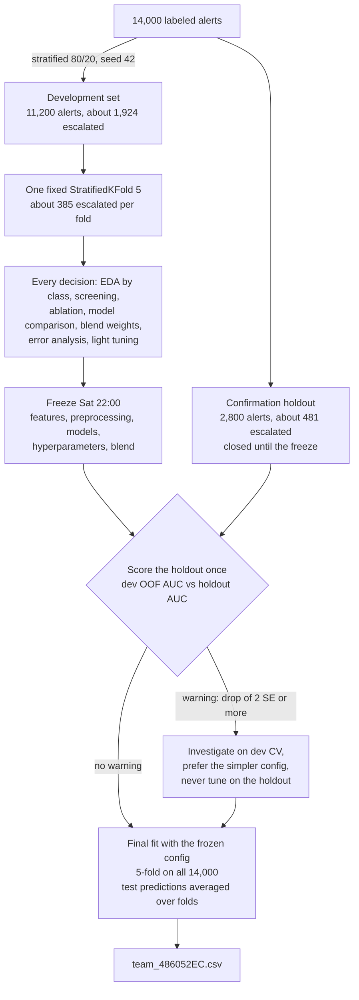

**Why this design:** test IDs and dates are interleaved with train (30% test share in every ID decile and every quarter, Phase 1), and no alerts share histories. That makes shuffled stratified K-fold the right primary scheme, and group-aware CV unnecessary. Five folds leave about 385 positives per fold, so repeated CV is not needed. The holdout is a **model-development confirmation set**, not a perfectly untouched set: some full-train label summaries were already seen in Phase 1. It is still valuable because no feature, model or blend choice will be optimized against it.

- [ ] 🔴 **2.1 Target distribution.** Counts, rate, imbalance: 2,405 of 14,000 escalated (17.2%, about 1 : 4.8). This was already seen in Phase 1 and is the stratification variable. → F01 (left panel)
- [ ] 🔴 **2.2 Freeze the split first.** A stratified 80/20 dev/holdout split (seed 42), one `StratifiedKFold(5, shuffle=True, random_state=42)` inside dev, and `final_folds` (the same recipe on all 14,000) for the final fit. Save `artifacts/split.csv` (`signal_id, part, dev_fold`) and log it in `decisions.md`. **From here on every label-based view uses `dev_sig` / `y_dev` only.** → A07
- [ ] 🔴 **2.3 Escalation rate over time (dev).** Monthly rate with a Wilson 95% CI. Dev has ~108 alerts a week, so a weekly CI would be ±7 pp; monthly gives ±3.4 pp. A step change suggests a policy change; a trend means drift, and a clear one would reopen time-aware validation. → A08, F01
- [ ] 🔴 **2.4 Train vs test weekly overlap.** Weekly alert counts and the weekly test share; no labels. This confirms the Phase 1 interleaving at weekly resolution. → A08, F02
- [ ] 🔴 **2.5 Adversarial validation.** LightGBM, train vs test, on the baseline features, 5-fold, no labels (all 14,000 train alerts may be used). An AUC ≈ 0.5 confirms the hidden set resembles train. If it is clearly above ~0.6, find the drifting features and make them relative. Put the number in the F02 caption. → A10
- [ ] 🟠 **2.6 Workload.** Alerts per day (train+test dates, no labels) against the escalation rate on dev: univariate AUC and decile rate. This is system context, not a raw-date identifier (§13). As a feature it stays P2 and enters only through the Phase 4 ablation. → A08
- [ ] 🟢 **2.7 Alert-date calendar.** Day of week, month, month-end, holidays (Navruz, Independence Day, Ramazon/Qurbon hayit). Low priority; keep only with a convincing relationship that CV agrees with. `signal_id`, row order and the raw alert date are **never** features.
- [ ] 🔴 **2.8 Baseline v0 + safety CSV (≤ 1h).** Full-history totals per direction × type (29 features); LightGBM on the dev folds; log the dev CV AUC in `cv_log.csv`. Predict test with the average of the 5 dev-fold models, then **write and validate `team_486052EC.csv`**, so a valid file always exists. → A09, A11, A12
- [ ] 🔴 **2.9 Freeze the validation design.** Record in `decisions.md`: split, folds and seed; the holdout protocol (scored once after the freeze, warning rule written before scoring); the final-fit recipe. After this, validation is not reopened.

**Done when:** `split.csv` and the folds are frozen, F01/F02 are exported, the adversarial AUC is logged, the baseline dev AUC is in `cv_log.csv`, and a valid `team_486052EC.csv` exists.

**Hand-off (end of Phase 2):** Handoff 0 (F00, glossary, D3) → website if not sent; baseline CSV + validator → QA.

---

## 8. Phase 3 — Behavioral EDA: escalated vs dismissed, dev set only (Fri 25 evening, ~5h) 🔴

**Rules for fair comparisons**

- **Dev set only.** Every by-class view uses `dev_sig` / `y_dev`. The holdout never appears in a plot.
- **Decompose every history:** background (lag ≥ 2) → trigger window (lag ≤ 1) → the change between the two. Compare the classes on each part, not on the mixed history.
- **Normalize per alert** (mean per alert, share within alert); otherwise long histories dominate.
- **Compare classes with ECDFs and decile escalation-rate curves with Wilson CIs**, not raw histograms, because imbalance hides the minority class.
- Use **log scale** for counts. Clip at p99 **for display only**.
- Check that key patterns also hold **within** type/direction segments (Simpson's paradox).
- Note how many slices you looked at, and don't over-read one surprising segment.
- **Don't keep a feature family because the trigger burst is visually striking.** Keep what separates the classes.

**Tasks**

- [ ] 🔴 **3.1 Background volume by class.** Background transactions per alert (ECDF, log-x). The lookback window is a common 180 days, so the old lookback-by-class figure is dropped. → F03
- [ ] 🟠 **3.2 Activity over calendar time.** Daily transaction counts, train vs test, by type (no labels). → F05
- [ ] 🔴 **3.3 Background activity before the alert.** Mean transactions per alert per day for lags 2–180, by class; repeat for amounts and for naqd/xalqaro separately. Where the curves separate sets the background windows (default 7/30/90/180). The trigger (lags 0–1) is reported next to the curve, not on the same axis. → A13, F06
- [ ] 🔴 **3.4 ★ Trigger-window test (§15).** The compact candidate set on dev:
  `trigger_count`, `trigger_rate_ratio` (= trigger_count / background_daily_rate) ·
  `trigger_outgoing_share`, `delta_outgoing_share` · `trigger_cash_share`, `delta_cash_share` ·
  `trigger_international_share`, `delta_international_share` · `trigger_mean_amount`, `delta_mean_amount` ·
  `trigger_same_second_share`, `trigger_tx_per_minute`, `trigger_median_gap_seconds`.
  For each variable: class ECDFs, escalation rate by decile with Wilson CI, univariate AUC, missingness, and the fold-to-fold AUC range. The single question to answer: **is the trigger itself predictive, is the change from baseline predictive, or neither?** The review's early class checks suggest raw trigger size is weak (§14); test the relative version before building the whole family. → A15 `trigger_screen`, F04
- [ ] 🟠 **3.5 Trigger boundary.** Compare `lag_days <= 1` with the burst core `secs_before <= 3600`. Within lag ≤ 1, 7,200 of 14,000 alerts also hold ordinary background transactions, which stretches the median trigger duration from 2.8 to 135 minutes. That is why compression and dormancy use the burst core (`BURST_SECS`). If the composition features (shares, amounts) score the same under both boundaries, keep the review's `lag_days <= 1` for them. Log the choice.
- [ ] 🔴 **3.6 Incoming vs outgoing.** In/out shares, in/out count ratio and hours from an inflow to the next outflow (background); trigger outgoing share vs background outgoing share; by class. Net flow in index units is not money (§9), so stick to counts, shares, timing and channel-relative sizes. → F07
- [ ] 🔴 **3.7 Channel mix.** Type mix per alert (100% stacked) by class, for background and trigger separately. Escalation rate by the change in cash / international share from background to trigger. → F08
- [ ] 🔴 **3.8 Amounts, channel-relative.** ECDF of the raw index by direction × type, by class; share of transactions above the channel's own p95/p99 (thresholds per direction × type from train+test transactions, no labels); trigger vs background mean, spread and upper-tail share within the same direction × type. No global thresholds, and no exact-repeat or round-amount checks (only 4 values repeat, and they are the per-type caps). → F09
- [ ] 🟠 **3.9 Trigger compression.** Same-second share, unique-timestamp ratio, max tx per second, duration, tx per minute, median and min gap in the burst core, by class. This is a hypothesis only: Phase 1 has **not** shown that escalated bursts are more compressed. It replaces the hour × weekday heatmap. → F10
- [ ] 🟠 **3.10 Sequences.** Transition lift between consecutive `dir_type` states (e.g. kirim_naqd → chiqim_xalqaro), dev only. → A13, F11
- [ ] 🟠 **3.11 Interactions.** 2-D escalation-rate heatmaps for the top pairs from 3.4–3.9 (e.g. `trigger_rate_ratio` × `delta_cash_share`, `delta_outgoing_share` × `background_median_h_in_to_out`).
- [ ] 🔴 **3.12 Error analysis** (after baseline v1, dev OOF only). Read the raw histories (background and trigger) of the 20 most confident misses: escalated alerts with the lowest scores, and dismissed alerts with the highest. Name what the model missed; that is your next feature.
- [ ] 🔴 **3.13 Record insights.** For every figure, capture *What we see / So what / Action* via `save_fig(..., finding, action)`.

**Done when:** F03–F10 are exported with insights; the trigger test says which of level / change / neither carries signal; the trigger boundary and the background windows are decided and logged.

**Handoff 1 (Fri night):** F01–F11 + `insights.json` → website teammate.

---

## 9. Phase 4 — EDA-driven features (Sat, 6–8h) 🔴

**D8 — Time decomposition around the alert** (`lag_days` = alert date − transaction date, in calendar days; no rows have lag < 0)

```text
lag:  180 ............. 90 ............. 30 ........ 7 ...... 2 | 1        0
      |<------------------ background: lag >= 2 -------------->|<-trigger->|
                        |<--------- bg90: lags 2-90 ---------->|  lag <= 1
                                         |<--- bg30 ---------->|
                                                    |<- bg7 -->|
                                                                  burst core: secs_before <= 3600
                                                                  (median 31 tx in ~3 minutes)

background_daily_rate = background_count / 179                  (lags 2-180)
trigger_rate_ratio    = trigger_count / background_daily_rate
bg7_rate_ratio        = (bg7_count / 6) / background_daily_rate  (same for bg30 / 29, bg90 / 89)
delta_<x>             = trigger_<x> - background_<x>            (shares, amounts, channel z)
```

**D9 — Feature families** (family names = the `FAMILY` map in A14, used by the ablation)

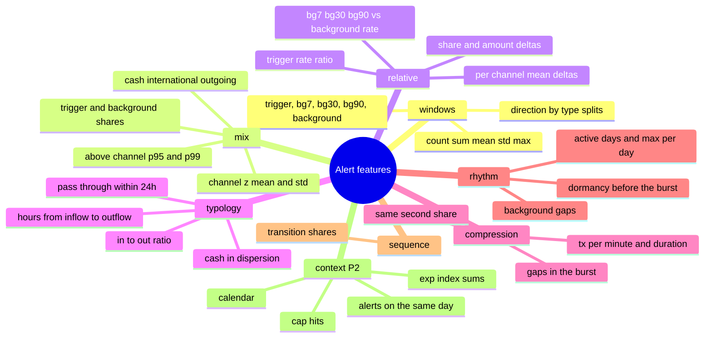

**D10 — Red-flag typology → feature in this data**

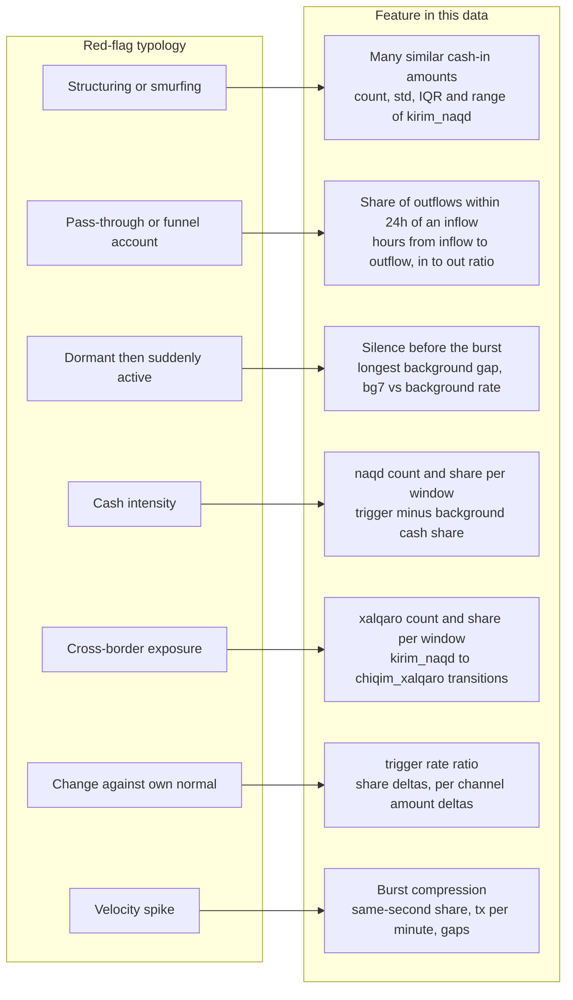

**Tasks** (priorities = review §17)

- [ ] 🔴 **4.1 Standard window aggregates (P0).** For trigger (lag ≤ 1), bg7, bg30, bg90 and background (lags 2–180): count, sum, mean, std and max of the index, as totals and per direction × type (count, sum, max). Counts and sums are filled with 0; other stats stay NaN. → A14 `window_aggs` (family `windows`)
- [ ] 🔴 **4.2 Trigger-window features (P0, §3).** Trigger count, mean, sum, max and std; cash, international and outgoing share; number of types. Keep them only if the 3.4 test supports them; otherwise they stay as ingredients of 4.3. → `window_aggs`, `mix_feats`
- [ ] 🔴 **4.3 Trigger vs background (P0, §4, the stronger hypothesis).** `trigger_rate_ratio`; deltas of outgoing, cash and international share, mean amount, amount std, max amount, channel z mean and above-p95 share; per direction × type mean-amount deltas; recent vs baseline rate (bg7, bg30, bg90 vs background). → `relative_feats` (family `relative`)
- [ ] 🔴 **4.4 Channel-relative amounts (P0, §8).** Mean, std, p95 and p99 per direction × type from train+test transactions (unsupervised, computed once). Counts above the channel p95/p99 per direction × type (e.g. `kirim_karta_above_p95_count`); channel-z mean/std and above-p95/p99 share for trigger and background. Raw-index statistics stay the primary interpretable amount features. → `channel_stats`, `add_amount_cols`, `mix_feats` (family `mix`)
- [ ] 🔴 **4.5 Flow & pass-through (P0).** Background share of outflows within 24h of an inflow, median hours from inflow to outflow, in/out ratio. Structuring proxy on *similar* (not identical) cash-in amounts: std, IQR and range of kirim_naqd; no CV, because the index is centred near 0. → `typology_feats`
- [ ] 🟠 **4.6 Trigger compression (P1, §5).** Same-second share, unique-timestamp ratio, max tx per second, duration, tx per minute, median and min gap, on the burst core. Remove them if the class distributions and CV show no difference. → `compression_feats`
- [ ] 🟠 **4.7 Rhythm: gaps, dormancy and burst (P1).** Background active days, max tx per day, gap min/median/max in hours, and dormancy before the burst. `recency_days` and `history_span_days` are gone because they are near-constant. → `rhythm_feats`
- [ ] 🟠 **4.8 Sequences (P1).** 64 transition shares between consecutive direction × type states. → `transition_shares` (family `sequence`). 🟢 A bag of tokens (direction_type × amount decile × lag bucket) only if ahead of schedule.
- [ ] 🟠 **4.9 Selected interactions (P1).** Only the pairs that 3.11 flags. GBDTs find most interactions on their own, so add explicit products or ratios only when they pass the ablation rule.
- [ ] 🟢 **4.10 P2 extras.** `alerts_same_day` (from 2.6), `cap_hits` (amount at the per-type cap), alert day of week and month, and `exp(index)` sums for trigger and background (a nonlinear representation, not money). Each is kept only if the ablation says so. → `context_feats` (family `context`)
- [ ] 🔴 **4.11 Univariate screen (dev).** AUC / Gini / IV per feature. IV > 0.5 or a single-feature AUC > 0.8 means: check for leakage before celebrating. AUC is computed on non-missing rows only, so read it together with the missing rate. → A15, F14
- [ ] 🔴 **4.12 Drift screen.** PSI train → test per feature, using bank bands (< 0.10 stable, 0.10–0.25 monitor, > 0.25 shifted), plus the adversarial AUC re-run on the full feature set (Phase 2 ran it on v0). Features are recomputed with the same code for test, so a shift here means the data, not the pipeline. → A15, F15
- [ ] 🔴 **4.13 Ablation by family.** Forward on the frozen dev folds, one seed: windows → mix → relative → typology → compression → rhythm → sequence → context. Keep a family only if mean dev AUC improves **and** at least 4 of 5 folds improve. → A15 `ablation`, F13, strong website material ("which EDA ideas paid off").
- [ ] 🟠 **4.14 Pruning.** Constant columns are dropped automatically in A14 (`nunique > 1`), so anything like `has_history`, `n_post_signal_tx` or a duplicate count can never reach the model (§12). Also drop exact duplicate and zero-gain columns. Optional null-importance test: shuffle the target 20 times and keep features whose real gain beats the 95th percentile of the null gain.

**Removed from the plan**

| Removed | Why (review §) |
|---|---|
| `night_share`, `weekend_share`, transaction hour and weekday | Hours 0–22 and weekdays are flat; hour 23 is the burst (§6) |
| Strict-pre-alert vs all-transactions branch, `n_post_signal_tx` | 0 rows after the alert date (§7) |
| `max_same_amount_count`, globally frequent amount share, round-amount flag, exact repeat counts | Only 4 repeated values, all per-type caps (§10) |
| Pseudo-customers, transaction-hash linkage, group CV, linked-alert and linked-label features | 0 rows shared between alerts (§11) |
| `has_history`, duplicate transaction count | Constant in this data; the checks stay in the audit (§12) |
| `recency_days`, `history_span_days` | Near-constant by construction (addition) |
| Global p95/p99 large-transaction counts | Types sit on different parts of the scale → channel-relative (§8) |
| `signal_id`, row order, raw alert date | Never features, diagnostic only (§13) |

**D11 — The EDA ↔ model loop**

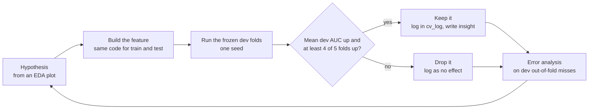

**Done when:** `FEATURES` (the ablation-kept columns) is frozen, the ablation table exists, and F12–F15 are exported.

---

## 10. Phase 5 — Modeling for max AUC (Sat evening, ~4h) 🔴

Everything here runs on the dev folds. No holdout numbers exist yet. The 80/20 dev/holdout design and the fixed dev folds stay as frozen in Phase 2 (D7): the holdout is scored once, in 6.2, after features, preprocessing, models, hyperparameters and blend are all frozen.

The ablation-kept set from Phase 4 (72 features: base, the 29 v0 totals, + amounts, the channel-relative amount family, + mix + compression; dev CV 0.637) is the starting candidate, not the final `FEATURES`. The feature set is chosen first; tuning, CatBoost, the blend and the final seed checks start only once it is frozen.

**Feature selection first** (dev CV only, the confirmation holdout stays closed; about 1h of the ~4h)

- [ ] 🔴 **5.0a Feature-set comparison.** Four fixed candidates on the frozen dev folds, with the untuned `LGB_PARAMS` and each of the three final seeds (`SEEDS = [42, 7, 2026]`):
  1. amounts only (30 features)
  2. base + amounts (59)
  3. base + amounts + mix (67)
  4. base + amounts + mix + compression, the current kept set (72)
  - **Compression is provisional.** It passed the 4.13 rule by +0.002 on seed 42, but its gain was −0.001 under seed 7 and −0.005 under seed 2026 (side check, Sat 26). This task brings that check into the notebook.
  - **Choice rule.** Walk up the list from the smallest set. A larger candidate replaces the current choice only if its mean dev AUC gain is positive under every seed **and** at least 4 of 5 folds improve on the seed-averaged fold AUCs. Otherwise the smaller set counts as matching it and is kept.
  - **Scope.** A closed check of four fixed candidates, not a new feature search, which is why extra seeds are allowed here (see 5.4). Log every candidate × seed in `cv_log.csv` and the choice in `decisions.md`.
- [ ] 🟠 **5.0b Pruning.** On the 5.0a winner, with the same folds and seeds (15 fits). This finishes 4.14; the constant and duplicate check already ran in Phase 4 and dropped none of the 199 features.
  - **Importance stability:** the gain share of every feature in each fold × seed fit, not only the mean.
  - **Negligible gain:** drop features below 0.2% of the total gain in all 15 fits.
  - **Redundancy:** for pairs with |Spearman ρ| ≥ 0.95 on dev, keep the one with the higher mean gain.
  - 🟢 **Null importance** (optional, from 4.14): shuffle the target 20 times and keep features whose real gain beats the 95th percentile of the null gain.
  - **Prefer the smallest stable set.** The pruned set replaces the 5.0a winner unless the winner beats it by the 5.0a choice rule, so the final set is the smallest one that matches or improves the larger set's dev OOF AUC.
- [ ] 🔴 **5.0c Freeze the feature set.** `FEATURES` = the 5.0b result (the 5.0a winner if 5.0b is skipped). Record the candidate table, the per-seed scores and the pruned columns in `decisions.md`. Everything from 5.1 on uses this set, and tuning never reopens it.

**Models, only after `FEATURES` is frozen**

- [ ] 🔴 **5.1 LightGBM** on the frozen dev folds and the frozen `FEATURES`, early stopping on AUC, deterministic mode. Start from `LGB_PARAMS` (A11). Tune lightly, on dev CV only with one seed, and only `learning_rate`, `num_leaves`, `min_data_in_leaf` and `feature_fraction`.
- [ ] 🔴 **5.2 CatBoost** (`CAT_PARAMS`, A11) on the same `FEATURES`, as the diversity model. It is often strong on mid-size tabular data, and its different trees make it a good blend partner. Its job is diversity, so it keeps `CAT_PARAMS` rather than being tuned.
- [ ] 🟠 **5.3 Third model** (XGBoost or ExtraTrees), only if it improves the dev OOF blend.
- [ ] 🔴 **5.4 Seed averaging, at the end only.** Once the solution is largely frozen: the same folds, `SEEDS = [42, 7, 2026]`, used by `fit_blend` in the holdout check and the final fit. Never during open-ended feature experiments or tuning; the closed checks in 5.0a and 5.0b are the only earlier uses.
- [ ] 🔴 **5.5 Blend.** Rank average (A16). Choose the weight on dev OOF from the coarse grid 0.3 / 0.5 / 0.7 only, not with a fine optimizer, which overfits.
- [ ] 🔴 **5.6 Stability report.** Dev fold mean ± std and the correlation between the models' predictions (roughly 0.85–0.98 is healthy, below 0.7 needs investigating). **Final seed-stability check:** the frozen configuration (features, parameters, blend weight) with each of the three `SEEDS`; report the dev CV AUC per seed for the blend and for LightGBM alone. If a gain the configuration relies on (the tuning, the blend over LightGBM alone) is smaller than the spread across seeds, prefer the simpler configuration and record why. 🟢 Time stress test: train on the oldest 80% of dev, validate on the newest 20% (`time_folds`, A07). It is reported, never used to select.
- [ ] 🟠 **5.7 Explainability.** Mean gain importance across folds; optional SHAP summary for the top 20. Check that the signs make business sense, e.g. transfers that are small for the alert's own card level → higher risk (F09, F12). → F17
- [ ] 🟠 **5.8 Business metrics for the website.** Dev OOF ROC curve, Gini, KS and capture@10/20/30% ("reviewing the top 20% of the queue catches X% of escalations"). → A16, F16
- [ ] 🔴 **5.9 Freeze the configuration (Sat 22:00).** `FEATURES` (from 5.0c), preprocessing, `LGB_PARAMS`, `CAT_PARAMS`, `SEEDS` and `W_LGB` go into `decisions.md`. **Write the holdout warning rule there before scoring:** warning if dev OOF AUC − holdout AUC ≥ 2 bootstrap SE (≈ 0.025 with 481 holdout positives). It is a warning threshold, not proof of generalization.

> **Tuning note:** keep any tuning code behind `RUN_TUNING = False` and paste the best parameters in as constants, so the final notebook runs fast.

---

## 11. Phase 6 — Freeze, confirm, final fit, submit (Sun) 🔴

- [ ] 🔴 **6.1 Feature freeze Sat 22:00.** `FEATURES` as chosen in 5.0a–5.0c, together with the 5.9 configuration. Sunday is for verification, not new ideas.
- [ ] 🔴 **6.2 Holdout confirmation, once (Sun 09:00).** `fit_blend` with the frozen config on the dev folds → predict the holdout → holdout AUC with a bootstrap CI vs the dev OOF AUC. Log both in `decisions.md` and `metrics.json`. The cell is added to the notebook only now, so no earlier run ever printed a holdout number. → A17
  - **No warning** (drop < 2 SE): go to 6.3. This supports the CV process; it does not prove that the model generalizes.
  - **Warning** (drop ≥ 2 SE): a warning, not a tuning signal. Investigate on dev CV (fold spread, the feature-set choice in 5.0a–5.0c, the blend weight). If a simpler configuration is clearly safer on dev CV, for example a smaller 5.0a candidate, switch to it and record why. Do not re-score the holdout to choose, and report the holdout number as it came out.
- [ ] 🔴 **6.3 Final fit on all 14,000.** The same frozen config on `final_folds` (5-fold on all labels), with early stopping inside each fold. Test predictions are averaged over folds and seeds, then rank-blended with `W_LGB`. The 20% is never kept out of the final model. → A18
- [ ] 🔴 **6.4 Sanity checks.** The test prediction distribution resembles the full OOF distribution, there are no NaNs, the LightGBM/CatBoost test correlation is healthy, and the validator passes.
- [ ] 🔴 **6.5 Restart & Run All** → CSV written → validator passes (A12) → note the md5.
- [ ] 🔴 **6.6 A teammate reproduces it on their laptop** from a fresh clone, with the data copied into `data/`. Expect the same row count and the same md5, or near-identical predictions if library versions differ.
- [ ] 🔴 **6.7 Runtime check.** The full run should finish in under ~30 min on a laptop. Features take ~20 s; CatBoost × 3 seeds × 5 folds × 2 fits (holdout + final) dominates. Time it in Phase 5, and cut CatBoost seeds or iterations if needed.
- [ ] 🔴 **6.8 Notebook narrative.** One markdown cell per section (what / why / finding), mirroring the website. Use "trigger window" consistently: the Phase 1 cells and `decisions.md` still say "cluster".
- [ ] 🔴 **6.9 README.** How to run, versions, expected runtime, outputs.
- [ ] 🔴 **6.10 Website check (teammate).** The public URL opens in an incognito window without login, and every required section is present (mapping in §14).
- [ ] 🔴 **6.11 Submit by 18:00:** `team_486052EC.csv` (TEAM_ID confirmed) + website URL + notebook. Keep a screenshot of the confirmation.

---

## 12. Edge-case register

| # | Edge case | How to detect | How to handle | Status after Phase 1 | Task |
|---|---|---|---|---|---|
| 1 | Alerts with no transactions | signal IDs minus transaction IDs | left-join on signals; counts/sums = 0, stats NaN | none in train or test; left join kept for robustness | 1.2, A09 |
| 2 | Orphan transactions | transaction IDs minus signal IDs | drop and report the count | none | 1.2 |
| 3 | Duplicate `signal_id` | `duplicated()` | stop and investigate | none | 1.1 |
| 4 | Test IDs ≠ sample-submission IDs | set and count comparison | build the submission from `test_signals` | equal | 1.2, A12 |
| 5 | Ambiguous date format | raw strings | strict `DATE_FMT` | ISO, all parsed | 0.5 |
| 6 | Timezone-aware or UTC timestamps | `dt.tz`; hour histogram | – | naive, no rhythm; timezone irrelevant | 1.6 |
| 7 | Date-only timestamps | share at 00:00 | – | second precision (0.05% at midnight) | 1.6 |
| 8 | Transactions after the alert date | share of `lag_days < 0` | – | none; one pipeline | 1.7 |
| 9 | Burst just after midnight on the alert day | `secs_before < 0` | covered by `lag_days <= 1` and by the burst core | 21 train alerts; documented off-by-one | 1.7, 3.5 |
| 10 | Alerts without a trigger burst | `trigger_count == 0` | trigger counts 0, trigger shares and deltas NaN; never impute | 152 train alerts | 4.2, 4.3 |
| 11 | Ordinary background tx inside `lag_days <= 1` | `lag_days <= 1 & secs_before > 3600` | compression and dormancy on the burst core | 7,200 of 14,000 alerts | 3.5, 4.6 |
| 12 | Placeholder or impossible values | min/max dates, sentinel amounts | treat as NaN; report counts | none | 1.4 |
| 13 | Category noise or test-only categories | value sets after strip + lower | explicit mapping | identical sets | 1.3 |
| 14 | Unknown amount scale | forensics | raw index + channel-relative features; `exp(index)` only as P2 | one global scale | 1.8, 4.4 |
| 15 | Amount caps per type | 4 exactly repeated values = type maxima | optional `cap_hits` (P2); not a round-amount signal | 120 train alerts hit a cap | 1.8, 4.10 |
| 16 | Heavy-tailed history length | p99 / max tx per alert | per-alert normalization; log axes | p99 1,350, max 2,279 | 1.11, 3.1 |
| 17 | Tiny histories | count distribution | NaN std/gaps are fine for GBDT; safe division | min 1 tx per alert | 4.x |
| 18 | Many transactions with the same timestamp | duplicated (signal, time) | stable sort; a gap of 0 is information → compression features | concentrated in the burst | 4.6 |
| 19 | Exact duplicate transaction rows | `duplicated()` | – | none | 1.5 |
| 20 | Shared histories across alerts | transaction hash | – | none; linkage removed | 1.10 |
| 21 | ID or row-order artifacts | AUC of ID number and row index | report; never a feature | none (0.498–0.508) | 1.9 |
| 22 | Test period later than train | F02, adversarial AUC | – | interleaved; confirm in 2.4–2.5 | 2.4, 2.5 |
| 23 | Escalation-policy drift | monthly rate with CI (dev) | a clear trend would reopen time-aware validation | to check | 2.3 |
| 24 | Few positives per fold | positives ÷ folds | – | ~385 per dev fold | 2.2 |
| 25 | Holdout leaking into decisions | any label-based view on all train after 2.2 | everything on dev; holdout cell only at the freeze | rule from Phase 2 | 2.2, 6.2 |
| 26 | Over-reading small segments | wide Wilson CIs | minimum bin sizes; CI on every rate plot | – | Phase 3 |
| 27 | Leakage through label-based features | any target or label encoding | compute inside dev folds only | none planned | 4.x |
| 28 | Feature drift train → test | PSI > 0.25 | drop, or make relative | to check | 4.12 |
| 29 | Train/test feature columns differ | column comparison | `X_te.reindex(columns=X_tr.columns)` | handled in A09/A14 | A14 |
| 30 | Constant columns | `nunique <= 1` | dropped before modeling | handled in A14 | 4.14 |
| 31 | Submission format errors | validator (A12) | run it before every save | – | 2.8, 6.5 |
| 32 | Non-determinism | two runs, compare md5 | seeds, `deterministic=True`, fixed thread count | toolkit verified on synthetic data | 6.5 |
| 33 | Runtime or memory on a reviewer's laptop | time the full run | category dtypes; fewer CatBoost seeds if needed | features ~20 s, 2.8 GB peak | 6.7 |

---

## 13. Banking-grade practices

| Practice | What to do here | Why it matters |
|---|---|---|
| Gini and KS next to AUC | `METRICS` in A16 | Standard discrimination measures in bank model validation |
| WoE / IV univariate screen | A15 | Classic scorecard check. IV bands: < 0.02 useless · 0.02–0.1 weak · 0.1–0.3 medium · 0.3–0.5 strong · > 0.5 suspicious |
| PSI stability | A10, A15 | Standard drift measure: < 0.10 stable · 0.10–0.25 monitor · > 0.25 shifted |
| Independent confirmation sample | 20% holdout scored once, warning rule written beforehand, then refit on all data | Mirrors out-of-sample validation in model risk management and guards against selection overfit |
| Risk-based, typology-driven features | D10 | Mirrors FFIEC / FINTRAC / FATF red-flag lists and is easy to explain |
| Behavior against the customer's own baseline | trigger vs background (4.3) | How analysts actually judge an alert |
| Explainability and sign checks | 5.7 | Triage models must be explainable to analysts and supervisors |
| Human-in-the-loop framing | capture@k in A16 | The model orders the queue; analysts still decide |
| Documented decisions and limitations | `decisions.md`, website | A model-risk-management habit that also answers reviewers' questions |
| Data protection | no raw data on public sites or repos | Good practice even with synthetic data |

---

## 14. Figure pack & website mapping

**Figure pack** (all exported to `figures/` by `save_fig`)

| ID | Figure | Chart | Question it answers | P |
|---|---|---|---|---|
| F00 ✅ | Dataset overview & audit, plus F00a hour/weekday, F00b relative time, F00c amount index | table + 3 figures | What data, and how clean is it? | done |
| F01 | Target distribution + monthly escalation rate (dev) | bar + line with CI | How rare is escalation, and is it stable? | 🔴 |
| F02 | Alerts per week, train vs test, with the adversarial AUC | line | How was the test set split? | 🔴 |
| F03 | Background transactions per alert by class | ECDF, log-x | Do escalated alerts have more normal activity? | 🔴 |
| F04 ★ | Trigger test: level vs change from baseline | decile small multiples + AUC table | Is the trigger predictive, the change, or neither? | 🔴 |
| F05 | Daily transaction volume by type | line / stacked area | Seasonality, drift, gaps? | 🟠 |
| F06 | Background activity before the alert by class (lags 2–180) | line | When does behavior change? | 🔴 |
| F07 | Incoming vs outgoing, in→out hours, trigger vs background outgoing share | bars + ECDF | Pass-through behavior? | 🔴 |
| F08 | Channel mix, background vs trigger, by class | 100% stacked + rate bars | Which channels shift before an escalation? | 🔴 |
| F09 | Channel-relative amounts by direction × type | ECDF small multiples | Size patterns within each channel? | 🔴 |
| F10 | Trigger compression by class | ECDF / decile | Are escalated bursts more compressed? | 🟠 |
| F11 | Transition lift | heatmap | Which sequences are risky? | 🟠 |
| F12 | Decile escalation rate for the top-6 features | small multiples with CI | Are relations strong and monotone? | 🔴 |
| F13 | Feature-family ablation | bar of ΔAUC | Which EDA ideas paid off? | 🟠 |
| F14 | Univariate AUC / IV ranking | horizontal bar | Strongest single signals | 🟠 |
| F15 | Drift: PSI + adversarial AUC on the full set | bar | Is test like train? | 🟠 |
| F16 | Dev OOF ROC, fold AUCs, capture@k, holdout AUC | ROC + table | How good and how stable? | 🔴 |
| F17 | Feature importance / SHAP | bar / beeswarm | What drives the model? | 🟠 |

**Website requirements → sources**

| Required on the website | Source in the notebook | Figures / artifacts |
|---|---|---|
| Short description of the approach | intro cell + D1 | D1 |
| Dataset overview and structure | Phase 1 | F00, D3, glossary |
| Several meaningful EDA visualizations | Phases 2–3 | F01–F11 |
| Key observations from the transaction history | Phase 3 | `insights.json` |
| Target distribution and behavioral patterns | 2.1–2.3, 3.1–3.10 | F01, F03, F04, F06–F10 |
| Features / modeling ideas motivated by EDA | Phase 4 | D8, D10, F12–F14, `feature_screen.csv`, `ablation.csv` |
| Brief conclusion | Phases 5–6 | F16, F17, `metrics.json` (dev OOF and holdout AUC) |

---

## 15. Team hand-offs

**D12 — Who sends what, when**

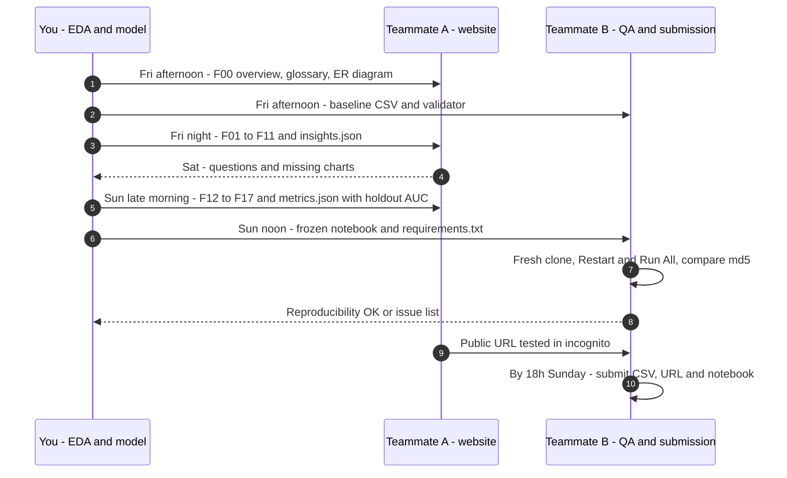

- The website only ever gets **small aggregated artifacts** (PNG figures, `insights.json`, `metrics.json`, `feature_screen.csv`, `ablation.csv`), produced by A18. Never raw data, never `split.csv`.
- Whoever submits must know the exact **team ID** used in the file name: `486052EC`, pending confirmation with the organisers.

---

## 16. Final notebook layout

**D13 — Sections of `solution.ipynb`** (headers without numbers in the notebook)

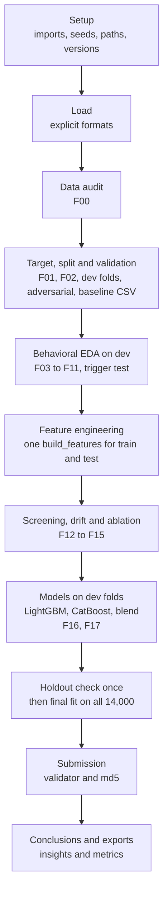

---

## 17. Anti-patterns (don't)

- **Don't build features from the transaction table and inner-join them.** That silently drops alerts without history and produces an invalid submission.
- **Don't look at the holdout before the freeze:** no plots, screens, error analysis or "just checking".
- **Don't score the holdout twice or use it to pick between candidates.** It is a warning light, not a tuning set.
- **Don't keep 20% of the labels out of the final model.**
- **Don't reshuffle folds between experiments.** One fixed set of dev folds, so AUC differences are comparable.
- **Don't run extra seeds during feature experiments.** Seeds come in at the end.
- **Don't choose the final model from one split** or from a +0.001 gain that sits inside fold noise.
- **Don't apply SMOTE or upsampling before splitting.** It leaks, and it rarely helps AUC anyway.
- **Don't fit target encoding on the full training set.**
- **Don't use `signal_id`, row order or the raw alert date as features.**
- **Don't build hour-of-day, weekday, round-amount, exact-repeat or linkage features.** Phase 1 showed there is nothing there.
- **Don't call `exp(index)` money,** and don't compute net flow in index units.
- **Don't keep the trigger family because the burst looks striking;** keep what separates the classes.
- **Don't compare raw per-class counts** without per-alert normalization.
- **Don't tune before the features are done.**
- **Don't publish raw data** on the website or in a public repo.
- **Don't leave the submission to Sunday 23:59.**
- **Don't search for the original dataset or labels.** The rules prohibit it.

---

## 18. References

- FFIEC BSA/AML Examination Manual, Appendix F — Money laundering and terrorist financing red flags: https://bsaaml.ffiec.gov/manual/Appendices/07
- FINTRAC — Money laundering and terrorist financing indicators (money services businesses): https://fintrac-canafe.canada.ca/guidance-directives/transaction-operation/indicators-indicateurs/msb_mltf-eng
- Sumsub — AML red flags guide (FATF-based sector lists): https://sumsub.com/blog/aml-red-flags-guide/
- Anti-Money Laundering Alert Optimization Using Machine Learning with Graphs (Feedzai, arXiv 2112.07508) — the triage-model concept and the 95–98% false-positive estimate: https://arxiv.org/html/2112.07508
- Dataiku — AML Alerts Triage solution (escalation model design): https://knowledge.dataiku.com/latest/solutions/financial-services/solution-aml-alerts-triage.html
- Mermaid documentation: https://mermaid.js.org

---

## Appendix A — Tested code toolkit

The blocks run top to bottom after the notebook's existing Setup, Load and Data audit cells, and they use the notebook's names: `tr_sig`, `te_sig`, `tr_tx`, `te_tx`, `sample`, `y`, `TARGET`, `SEED`, `FIG_DIR`, `ART_DIR`, `SUB_DIR`, `save_fig`, `INSIGHTS`, and `tr_m` / `te_m` with `lag_days` and `secs_before` from `add_rel_time`. Each block ends with a bare expression that displays its result. Replace the `"<finding>"` / `"<action>"` placeholders in `save_fig` with the real reading.

Set after Phase 3: `TRIGGER_MAX_LAG`, `BURST_SECS` and `BG_WINDOWS` (A09). Confirm in Phase 5: `SEEDS` (A17). A14 needs `per_day` from A08 and `transition_shares` from A13.

| ID | What it does | Used in |
|---|---|---|
| A01–A05 | Setup, loaders, audit, relative time, amount forensics, ID artifacts, shared-history check | Phase 0–1 ✅, the notebook's cells are canonical |
| A06 | Extra imports, Wilson CI, rate by decile | Phase 2–4 |
| A07 | 80/20 dev/holdout split, dev folds, final folds, time stress split, `split.csv` | 2.2 |
| A08 | Monthly escalation rate (dev), weekly train vs test, workload | 2.1, 2.3, 2.4, 2.6 |
| A09 | Trigger / background / burst parts, window aggregates, baseline v0 features | 2.8, 4.1 |
| A10 | Adversarial AUC + PSI (baseline) | 2.5 |
| A11 | LightGBM and CatBoost CV + experiment log + baseline v0 run | 2.8, Phase 5 |
| A12 | Submission writer + validator + md5 (safety CSV) | 2.8, 6.5 |
| A13 | Background activity curve by class, transition shares and lift | 3.3, 3.10, 4.8 |
| A14 | Channel stats and every feature family, `build_features` | Phase 4 |
| A15 | Univariate screen with fold stability, trigger test, drift on the full set, ablation | 3.4, 4.11–4.13 |
| A16 | Dev models, blend weight, business metrics, time stress test | Phase 5 |
| A17 | Holdout confirmation, once | 6.2 |
| A18 | Final fit on all 14,000, final CSV, hand-off exports | 6.3, §15 |

### A06 — Extra imports, Wilson CI, rate by decile

```python
import hashlib

from catboost import CatBoostClassifier
from scipy.stats import rankdata
from sklearn.metrics import roc_curve
from sklearn.model_selection import StratifiedKFold, cross_val_predict, train_test_split

CLASS_COLORS = {0: "#4C72B0", 1: "#C44E52"}


def wilson(k, n, z=1.96):
    k, n = np.asarray(k, dtype=float), np.asarray(n, dtype=float)
    p = k / n
    d = 1 + z**2 / n
    c = (p + z**2 / (2 * n)) / d
    h = z * np.sqrt(p * (1 - p) / n + z**2 / (4 * n**2)) / d
    return c - h, c + h


def rate_by_bin(x, y, q=10):
    x = pd.Series(np.asarray(x, dtype=float))
    g = (
        pd.DataFrame({"b": pd.qcut(x.rank(method="first"), q, labels=False), "x": x, "y": np.asarray(y)})
        .dropna(subset=["b"])
        .groupby("b")
        .agg(n=("y", "size"), k=("y", "sum"), x_med=("x", "median"))
    )
    g["rate"] = g["k"] / g["n"]
    g["lo"], g["hi"] = wilson(g["k"], g["n"])
    return g


def plot_rate_by_bin(x, y, name, ax):
    g = rate_by_bin(x, y)
    ax.errorbar(range(len(g)), g["rate"], yerr=[g["rate"] - g["lo"], g["hi"] - g["rate"]], marker="o", capsize=3)
    ax.axhline(np.mean(y), ls="--", c="grey", lw=1)
    ax.set_title(name, fontsize=10)
    ax.set_xlabel("decile")
    ax.set_ylabel("escalation rate")
```

### A07 — Validation design: dev/holdout split, dev folds, final folds

The split is stratified on the target; the dev folds are positions inside the dev set; `final_folds` is the same recipe on all 14,000 for 6.3. `time_folds` (oldest 80% of dev → newest 20%) is only the optional stress test.

```python
dev_idx, hold_idx = train_test_split(np.arange(len(y)), test_size=0.2, stratify=y, random_state=SEED)
dev_idx, hold_idx = np.sort(dev_idx), np.sort(hold_idx)
y_dev, y_hold = y[dev_idx], y[hold_idx]
dev_sig = tr_sig.iloc[dev_idx].reset_index(drop=True)

folds = list(StratifiedKFold(5, shuffle=True, random_state=SEED).split(np.zeros(len(y_dev)), y_dev))
final_folds = list(StratifiedKFold(5, shuffle=True, random_state=SEED).split(np.zeros(len(y)), y))

dev_order = dev_sig["signal_sanasi"].rank(method="first").to_numpy()
time_folds = [(np.where(dev_order <= 0.8 * len(dev_order))[0], np.where(dev_order > 0.8 * len(dev_order))[0])]

split = pd.DataFrame({"signal_id": tr_sig["signal_id"], "part": "holdout", "dev_fold": -1})
split.loc[dev_idx, "part"] = "dev"
for k, (_, va) in enumerate(folds):
    split.loc[dev_idx[va], "dev_fold"] = k
split.to_csv(ART_DIR / "split.csv", index=False)
split.assign(y=y).groupby(["part", "dev_fold"])["y"].agg(alerts="size", positives="sum", rate="mean").round(4)
```

### A08 — Phase 2 views: target, monthly rate (dev), weekly train vs test, workload

```python
monthly = dev_sig.set_index("signal_sanasi").resample("MS")[TARGET].agg(["sum", "count"])
monthly["rate"] = monthly["sum"] / monthly["count"]
monthly["lo"], monthly["hi"] = wilson(monthly["sum"], monthly["count"])

fig, axes = plt.subplots(1, 2, figsize=(12, 3.5), gridspec_kw={"width_ratios": [1, 3]})
axes[0].bar(["dismissed", "escalated"], np.bincount(y), color=[CLASS_COLORS[0], CLASS_COLORS[1]])
axes[1].plot(monthly.index, monthly["rate"], marker="o", color=CLASS_COLORS[1])
axes[1].fill_between(monthly.index, monthly["lo"], monthly["hi"], color=CLASS_COLORS[1], alpha=0.2)
axes[1].axhline(y_dev.mean(), ls="--", c="grey", lw=1)
axes[1].set_ylabel("escalation rate, dev set")
save_fig(fig, "F01_target_and_monthly_rate", "<finding>", "<action>")

weekly = pd.concat(
    {
        "train": tr_sig.set_index("signal_sanasi").resample("W").size(),
        "test": te_sig.set_index("signal_sanasi").resample("W").size(),
    },
    axis=1,
).fillna(0)
weekly["test_share"] = weekly["test"] / (weekly["train"] + weekly["test"])

fig, ax = plt.subplots(figsize=(12, 3.5))
weekly[["train", "test"]].plot(ax=ax)
ax.set_ylabel("alerts per week")
save_fig(fig, "F02_alerts_per_week_train_test", "<finding>", "<action>")

per_day = pd.concat([tr_sig["signal_sanasi"], te_sig["signal_sanasi"]]).value_counts()
alerts_same_day = tr_sig["signal_sanasi"].map(per_day).to_numpy()
{
    "test_share_weekly_min": weekly["test_share"].min(),
    "test_share_weekly_max": weekly["test_share"].max(),
    "auc_alerts_same_day_dev": roc_auc_score(y_dev, alerts_same_day[dev_idx]),
}
```

### A09 — Trigger / background parts, window aggregates, baseline v0

`add_parts` sorts each history by time once (the gap, pass-through and sequence features rely on it) and adds the trigger, burst, direction × type and channel flags. The baseline v0 uses one `"all"` window: full-history totals per direction × type.

```python
TRIGGER_MAX_LAG = 1
BURST_SECS = 3600
BG_WINDOWS = [7, 30, 90]
BG_DAYS = 179
VAL = "miqdor_indeksi"
DIR_TYPES = [f"{d}_{t}" for d in ("chiqim", "kirim") for t in ("bank_otkazmasi", "karta", "naqd", "xalqaro")]
ZERO_FILL = ("_count", "_sum", "_sum_amount", "cap_hits", "_exp_sum")


def add_parts(m):
    m = m.sort_values(["signal_id", "tranzaksiya_vaqti"], kind="stable", ignore_index=True)
    m["dir_type"] = pd.Categorical(m["kirim_chiqim"].astype(str) + "_" + m["tranzaksiya_turi"].astype(str), categories=DIR_TYPES)
    m["trigger"] = m["lag_days"] <= TRIGGER_MAX_LAG
    m["burst"] = m["secs_before"] <= BURST_SECS
    m["is_out"] = m["kirim_chiqim"] == "chiqim"
    m["is_cash"] = m["tranzaksiya_turi"] == "naqd"
    m["is_intl"] = m["tranzaksiya_turi"] == "xalqaro"
    return m


def window_masks(m):
    bg = ~m["trigger"]
    return {"trigger": m["trigger"], **{f"bg{w}": bg & (m["lag_days"] <= w) for w in BG_WINDOWS}, "background": bg}


def window_aggs(m, masks):
    parts = []
    for tag, mask in masks.items():
        sub = m[mask]
        g = sub.groupby("signal_id")[VAL]
        parts.append(
            pd.DataFrame(
                {
                    f"{tag}_count": g.size(),
                    f"{tag}_sum_amount": g.sum(),
                    f"{tag}_mean_amount": g.mean(),
                    f"{tag}_amount_std": g.std(),
                    f"{tag}_max_amount": g.max(),
                }
            )
        )
        d = sub.groupby(["signal_id", "dir_type"], observed=False)[VAL].agg(count="size", sum="sum", max="max").unstack()
        d.columns = [f"{tag}_{t}_{a}" for a, t in d.columns]
        parts.append(d)
    return pd.concat(parts, axis=1)


def on_signals(F, sig):
    F = F.reindex(sig["signal_id"])
    zero = F.columns[F.columns.str.endswith(ZERO_FILL)]
    F[zero] = F[zero].fillna(0)
    return F


tr_m, te_m = add_parts(tr_m), add_parts(te_m)
X0_tr = on_signals(window_aggs(tr_m, {"all": np.ones(len(tr_m), dtype=bool)}), tr_sig).reset_index(drop=True)
X0_te = on_signals(window_aggs(te_m, {"all": np.ones(len(te_m), dtype=bool)}), te_sig).reset_index(drop=True)
X0_te = X0_te.reindex(columns=X0_tr.columns)
X0_tr.shape, X0_te.shape
```

### A10 — Adversarial validation and PSI

```python
def adversarial_auc(Xtr, Xte, seed=SEED):
    X = pd.concat([Xtr, Xte], ignore_index=True)
    is_test = np.r_[np.zeros(len(Xtr)), np.ones(len(Xte))]
    clf = lgb.LGBMClassifier(
        n_estimators=300, learning_rate=0.05, num_leaves=31, subsample=0.8, subsample_freq=1,
        colsample_bytree=0.8, random_state=seed, n_jobs=4, verbose=-1,
    )
    cv = StratifiedKFold(5, shuffle=True, random_state=seed)
    p = cross_val_predict(clf, X, is_test, cv=cv, method="predict_proba")[:, 1]
    clf.fit(X, is_test)
    imp = pd.Series(clf.booster_.feature_importance("gain"), index=X.columns).sort_values(ascending=False)
    return roc_auc_score(is_test, p), imp


def psi(expected, actual, bins=10, eps=1e-6):
    e, a = pd.Series(expected).dropna(), pd.Series(actual).dropna()
    edges = np.unique(np.quantile(e, np.linspace(0, 1, bins + 1)))
    edges[0], edges[-1] = -np.inf, np.inf
    pe = np.clip(np.histogram(e, edges)[0] / len(e), eps, None)
    pa = np.clip(np.histogram(a, edges)[0] / len(a), eps, None)
    return float(np.sum((pa - pe) * np.log(pa / pe)))


adv_auc_v0, adv_imp_v0 = adversarial_auc(X0_tr, X0_te)
adv_auc_v0, adv_imp_v0.head(5).round(1).to_dict()
```

### A11 — Models and experiment log, baseline v0 on the dev folds

`run_cv` returns OOF predictions on the rows it was given and the fold-averaged predictions for every frame in `X_pred`. The baseline predicts test with the 5 dev-fold models.

```python
LGB_PARAMS = dict(
    objective="binary", metric="auc", learning_rate=0.03, num_leaves=31, min_data_in_leaf=50,
    feature_fraction=0.7, bagging_fraction=0.8, bagging_freq=1, lambda_l2=1.0, seed=SEED,
    deterministic=True, force_col_wise=True, num_threads=4, verbose=-1,
)
CAT_PARAMS = dict(iterations=3000, learning_rate=0.03, depth=6, eval_metric="AUC", od_type="Iter", od_wait=200, verbose=0, thread_count=4)


def run_cv(X, y, folds, X_pred=(), params=LGB_PARAMS, seed=SEED):
    oof, preds, scores, imps = np.zeros(len(X)), [np.zeros(len(P)) for P in X_pred], [], []
    for tr, va in folds:
        bst = lgb.train(
            {**params, "seed": seed}, lgb.Dataset(X.iloc[tr], y[tr]), 10000,
            valid_sets=[lgb.Dataset(X.iloc[va], y[va])], callbacks=[lgb.early_stopping(200, verbose=False)],
        )
        oof[va] = bst.predict(X.iloc[va], num_iteration=bst.best_iteration)
        for p, P in zip(preds, X_pred):
            p += bst.predict(P, num_iteration=bst.best_iteration) / len(folds)
        scores.append(roc_auc_score(y[va], oof[va]))
        imps.append(pd.Series(bst.feature_importance("gain"), index=X.columns))
    return oof, preds, np.array(scores), pd.concat(imps, axis=1).mean(axis=1).sort_values(ascending=False)


def run_cv_cat(X, y, folds, X_pred=(), seed=SEED):
    oof, preds, scores = np.zeros(len(X)), [np.zeros(len(P)) for P in X_pred], []
    for tr, va in folds:
        m = CatBoostClassifier(**CAT_PARAMS, random_seed=seed)
        m.fit(X.iloc[tr], y[tr], eval_set=(X.iloc[va], y[va]), use_best_model=True)
        oof[va] = m.predict_proba(X.iloc[va])[:, 1]
        for p, P in zip(preds, X_pred):
            p += m.predict_proba(P)[:, 1] / len(folds)
        scores.append(roc_auc_score(y[va], oof[va]))
    return oof, preds, np.array(scores)


LOG = ART_DIR / "cv_log.csv"


def log_run(name, scores, n_feats, note=""):
    row = {
        "time": pd.Timestamp.now(tz="Asia/Tashkent").strftime("%m-%d %H:%M"), "run": name,
        "cv_auc": round(float(scores.mean()), 5), "cv_std": round(float(scores.std()), 5),
        "gini": round(float(2 * scores.mean() - 1), 5), "folds": " ".join(f"{s:.4f}" for s in scores),
        "n_feats": n_feats, "note": note,
    }
    pd.DataFrame([row]).to_csv(LOG, mode="a", header=not LOG.exists(), index=False)
    return row


_, (pred_v0,), s_v0, imp_v0 = run_cv(X0_tr.iloc[dev_idx], y_dev, folds, [X0_te])
log_run("lgb_v0_baseline", s_v0, X0_tr.shape[1], "full-history totals, dev CV")
```

### A12 — Submission writer + validator (safety CSV from the baseline)

```python
TEAM_ID = "486052EC"


def write_submission(test_sig, pred, team_id=TEAM_ID):
    sub = pd.DataFrame({"signal_id": test_sig["signal_id"].to_numpy(), "ehtimollik": np.clip(pred, 0, 1)})
    path = SUB_DIR / f"team_{team_id}.csv"
    sub.to_csv(path, index=False, float_format="%.6f")
    return path


def validate_submission(path, test_ids):
    s = pd.read_csv(path, dtype={"signal_id": "string"})
    assert list(s.columns) == ["signal_id", "ehtimollik"], f"columns: {list(s.columns)}"
    assert len(s) == len(test_ids), f"rows {len(s)} != {len(test_ids)}"
    assert s["signal_id"].is_unique, "duplicate IDs"
    assert set(s["signal_id"]) == set(test_ids), "missing or unknown IDs"
    assert np.isfinite(s["ehtimollik"]).all(), "NaN or inf predictions"
    assert s["ehtimollik"].between(0, 1).all(), "values outside [0, 1]"
    assert s["ehtimollik"].nunique() > 1, "constant predictions"
    assert path.name == f"team_{TEAM_ID}.csv", f"bad filename {path.name}"
    return {"rows": len(s), "md5": hashlib.md5(path.read_bytes()).hexdigest(), **s["ehtimollik"].describe()[["min", "50%", "max"]].round(4).to_dict()}


path = write_submission(te_sig, pred_v0)
validate_submission(path, te_sig["signal_id"])
```

### A13 — Phase 3 views: background activity by class, transition lift

```python
def activity_curve(m, sig):
    lab = sig.set_index("signal_id")[TARGET]
    sub = m[m["signal_id"].isin(lab.index)]
    cnt = sub.groupby([sub["signal_id"].map(lab).rename(TARGET), "lag_days"]).size()
    return (cnt / lab.value_counts().reindex(cnt.index.get_level_values(0)).to_numpy()).unstack(0)


def transition_shares(m):
    sid, code = m["signal_id"].to_numpy(), m["dir_type"].cat.codes.to_numpy().astype(np.int64)
    keep = sid[1:] == sid[:-1]
    k = len(DIR_TYPES)
    pairs = pd.DataFrame({"signal_id": sid[:-1][keep], "pair": code[:-1][keep] * k + code[1:][keep]})
    t = pairs.groupby(["signal_id", "pair"]).size().unstack(fill_value=0).reindex(columns=range(k * k), fill_value=0)
    t = t.div(t.sum(axis=1), axis=0)
    t.columns = [f"seq_{DIR_TYPES[p // k]}>{DIR_TYPES[p % k]}" for p in t.columns]
    return t


curve = activity_curve(tr_m, dev_sig)
fig, ax = plt.subplots(figsize=(10, 3.5))
curve.loc[2:].plot(ax=ax, color=[CLASS_COLORS[0], CLASS_COLORS[1]])
ax.invert_xaxis()
ax.set_xlabel("days before the alert (background, lag 2 to 180)")
ax.set_ylabel("tx per alert per day")
save_fig(fig, "F06_background_activity_by_class", "<finding>", "<action>")

seq = transition_shares(tr_m)
lab = dev_sig.set_index("signal_id")[TARGET]
lift = seq.reindex(lab.index).groupby(lab.to_numpy()).mean().T
lift["lift"] = lift[1] / lift[0]
curve.loc[[0, 1]].round(2), lift.sort_values("lift", ascending=False).head(5).round(3)
```

### A14 — Feature builders

Channel thresholds use train+test transactions without labels and are computed once. Relative features are derived from the window and mix columns after zero-filling, so an alert without a trigger gets `trigger_count = 0` and NaN shares and deltas. `FAMILY` maps every column to its family for the ablation.

```python
def channel_stats(*ms):
    a = pd.concat([m[["dir_type", "tranzaksiya_turi", VAL]] for m in ms], ignore_index=True)
    g = a.groupby("dir_type", observed=False)[VAL]
    ch = pd.DataFrame({"mean": g.mean(), "std": g.std(), "p95": g.quantile(0.95), "p99": g.quantile(0.99)})
    type_cap = a.groupby("tranzaksiya_turi", observed=True)[VAL].max()
    ch["cap"] = [type_cap[t.split("_", 1)[1]] for t in ch.index]
    return ch


def add_amount_cols(m, ch):
    code, v = m["dir_type"].cat.codes.to_numpy(), m[VAL].to_numpy()
    m["channel_z"] = (v - ch["mean"].to_numpy()[code]) / ch["std"].to_numpy()[code]
    m["above_p95"] = v > ch["p95"].to_numpy()[code]
    m["above_p99"] = v > ch["p99"].to_numpy()[code]
    m["at_cap"] = v >= ch["cap"].to_numpy()[code]
    return m


def mix_feats(m, masks):
    parts = []
    for tag in ("trigger", "background"):
        g = m[masks[tag]].groupby("signal_id")
        parts.append(
            pd.DataFrame(
                {
                    f"{tag}_outgoing_share": g["is_out"].mean(),
                    f"{tag}_cash_share": g["is_cash"].mean(),
                    f"{tag}_international_share": g["is_intl"].mean(),
                    f"{tag}_n_types": g["tranzaksiya_turi"].nunique(),
                    f"{tag}_channel_z_mean": g["channel_z"].mean(),
                    f"{tag}_channel_z_std": g["channel_z"].std(),
                    f"{tag}_above_p95_share": g["above_p95"].mean(),
                    f"{tag}_above_p99_share": g["above_p99"].mean(),
                }
            )
        )
    tail = m.groupby(["signal_id", "dir_type"], observed=False)[["above_p95", "above_p99"]].sum().unstack()
    tail.columns = [f"{t}_{a}_count" for a, t in tail.columns]
    return pd.concat(parts + [tail], axis=1)


def typology_feats(m):
    bg = m[~m["trigger"]]
    sid = bg["signal_id"]
    last_in = bg["tranzaksiya_vaqti"].where(~bg["is_out"]).groupby(sid).ffill()
    h_in_out = ((bg["tranzaksiya_vaqti"] - last_in).dt.total_seconds() / 3600).where(bg["is_out"])
    n_out = bg["is_out"].groupby(sid).sum().replace(0, np.nan)
    cash_in = m[m["dir_type"] == "kirim_naqd"].groupby("signal_id")[VAL]
    return pd.DataFrame(
        {
            "background_out_within_24h_of_in_share": (h_in_out <= 24).groupby(sid).sum() / n_out,
            "background_median_h_in_to_out": h_in_out.groupby(sid).median(),
            "background_in_out_ratio": (~bg["is_out"]).groupby(sid).sum() / n_out,
            "cash_in_amount_std": cash_in.std(),
            "cash_in_amount_iqr": cash_in.quantile(0.75) - cash_in.quantile(0.25),
            "cash_in_amount_range": cash_in.max() - cash_in.min(),
        }
    )


def compression_feats(m):
    b = m[m["burst"]]
    sid, t = b["signal_id"], b["tranzaksiya_vaqti"]
    n = b.groupby("signal_id").size()
    per_sec = b.groupby(["signal_id", "tranzaksiya_vaqti"]).size()
    gap = t.groupby(sid).diff().dt.total_seconds()
    f = pd.DataFrame(
        {
            "trigger_same_second_share": b.duplicated(["signal_id", "tranzaksiya_vaqti"], keep=False).groupby(sid).mean(),
            "trigger_unique_timestamp_ratio": per_sec.groupby(level=0).size() / n,
            "trigger_max_tx_per_second": per_sec.groupby(level=0).max(),
            "trigger_duration_seconds": (t.groupby(sid).max() - t.groupby(sid).min()).dt.total_seconds(),
            "trigger_median_gap_seconds": gap.groupby(sid).median(),
            "trigger_min_gap_seconds": gap.groupby(sid).min(),
        }
    )
    f["trigger_tx_per_minute"] = n / (f["trigger_duration_seconds"] / 60).clip(lower=1 / 60)
    return f


def rhythm_feats(m):
    bg = m[~m["trigger"]]
    sid = bg["signal_id"]
    gap_h = bg["tranzaksiya_vaqti"].groupby(sid).diff().dt.total_seconds() / 3600
    daily = bg.groupby(["signal_id", "lag_days"]).size()
    burst_start = m[m["burst"]].groupby("signal_id")["tranzaksiya_vaqti"].min()
    last_before = m[~m["burst"]].groupby("signal_id")["tranzaksiya_vaqti"].max()
    return pd.DataFrame(
        {
            "background_active_days": daily.groupby(level=0).size(),
            "background_max_tx_per_day": daily.groupby(level=0).max(),
            "background_gap_h_min": gap_h.groupby(sid).min(),
            "background_gap_h_median": gap_h.groupby(sid).median(),
            "background_gap_h_max": gap_h.groupby(sid).max(),
            "dormancy_before_burst_h": (burst_start - last_before).dt.total_seconds() / 3600,
        }
    )


def context_feats(sig, m, per_day):
    ev, sid = np.exp(m[VAL]), m["signal_id"]
    f = pd.DataFrame(
        {
            "cap_hits": m.groupby("signal_id")["at_cap"].sum(),
            "trigger_exp_sum": ev.where(m["trigger"], 0).groupby(sid).sum(),
            "background_exp_sum": ev.where(~m["trigger"], 0).groupby(sid).sum(),
        }
    ).reindex(sig["signal_id"])
    f["alerts_same_day"] = sig["signal_sanasi"].map(per_day).to_numpy()
    f["alert_dow"] = sig["signal_sanasi"].dt.dayofweek.to_numpy()
    f["alert_month"] = sig["signal_sanasi"].dt.month.to_numpy()
    return f


def relative_feats(F):
    bg_rate = F["background_count"].replace(0, np.nan) / BG_DAYS
    r = pd.DataFrame({"trigger_rate_ratio": F["trigger_count"] / bg_rate}, index=F.index)
    for w in BG_WINDOWS:
        r[f"bg{w}_rate_ratio"] = F[f"bg{w}_count"] / (w - 1) / bg_rate
    for s in ("mean_amount", "amount_std", "max_amount", "outgoing_share", "cash_share", "international_share", "channel_z_mean", "above_p95_share"):
        r[f"delta_{s}"] = F[f"trigger_{s}"] - F[f"background_{s}"]
    for t in DIR_TYPES:
        trig = F[f"trigger_{t}_sum"] / F[f"trigger_{t}_count"].replace(0, np.nan)
        back = F[f"background_{t}_sum"] / F[f"background_{t}_count"].replace(0, np.nan)
        r[f"delta_{t}_mean_amount"] = trig - back
    return r


def build_features(sig, m, per_day):
    masks = window_masks(m)
    blocks = {
        "windows": window_aggs(m, masks),
        "mix": mix_feats(m, masks),
        "typology": typology_feats(m),
        "compression": compression_feats(m),
        "rhythm": rhythm_feats(m),
        "sequence": transition_shares(m),
    }
    F = on_signals(pd.concat(blocks.values(), axis=1), sig)
    blocks["context"] = on_signals(context_feats(sig, m, per_day), sig)
    blocks["relative"] = relative_feats(F)
    family = {c: k for k, b in blocks.items() for c in b.columns}
    return pd.concat([F, blocks["context"], blocks["relative"]], axis=1).reset_index(drop=True), family


CH = channel_stats(tr_m, te_m)
tr_m, te_m = add_amount_cols(tr_m, CH), add_amount_cols(te_m, CH)
X_tr, FAMILY = build_features(tr_sig, tr_m, per_day)
X_tr = X_tr.loc[:, X_tr.nunique(dropna=False) > 1]
X_te = build_features(te_sig, te_m, per_day)[0].reindex(columns=X_tr.columns)
assert len(X_tr) == len(tr_sig) and len(X_te) == len(te_sig)
X_dev, X_hold = X_tr.iloc[dev_idx], X_tr.iloc[hold_idx]
X_tr.shape, X_te.shape, pd.Series({c: FAMILY[c] for c in X_tr.columns}).value_counts().to_dict()
```

### A15 — Screening, trigger test, drift on the full set, ablation

```python
def univariate_report(X, y, folds=None, bins=10):
    y = pd.Series(np.asarray(y), index=X.index)
    rows = []
    for c in X.columns:
        x = X[c]
        ok = x.notna()
        if ok.sum() < 50 or x[ok].nunique() < 2:
            continue
        auc = roc_auc_score(y[ok], x[ok])
        b = (x if x[ok].nunique() <= bins else pd.qcut(x.rank(method="first"), bins, labels=False)).fillna(-1)
        t = pd.crosstab(b, y).reindex(columns=[0, 1], fill_value=0) + 0.5
        bad, good = t[1] / t[1].sum(), t[0] / t[0].sum()
        row = {"feature": c, "auc": auc, "gini_abs": abs(2 * auc - 1), "iv": float(((bad - good) * np.log(bad / good)).sum()), "missing": 1 - ok.mean()}
        if folds is not None:
            fold_auc = [roc_auc_score(y.iloc[va][ok.iloc[va]], x.iloc[va][ok.iloc[va]]) for _, va in folds]
            row["auc_fold_min"], row["auc_fold_max"] = min(fold_auc), max(fold_auc)
        rows.append(row)
    return pd.DataFrame(rows).sort_values("gini_abs", ascending=False).reset_index(drop=True)


TRIGGER_TEST = [
    "trigger_count", "trigger_rate_ratio",
    "trigger_outgoing_share", "delta_outgoing_share",
    "trigger_cash_share", "delta_cash_share",
    "trigger_international_share", "delta_international_share",
    "trigger_mean_amount", "delta_mean_amount",
    "trigger_same_second_share", "trigger_tx_per_minute", "trigger_median_gap_seconds",
]
trigger_screen = univariate_report(X_dev[TRIGGER_TEST], y_dev, folds)

fig, axes = plt.subplots(3, 5, figsize=(18, 9))
for c, ax in zip(TRIGGER_TEST, axes.ravel()):
    plot_rate_by_bin(X_dev[c], y_dev, c, ax)
for ax in axes.ravel()[len(TRIGGER_TEST):]:
    ax.set_visible(False)
fig.tight_layout()
save_fig(fig, "F04_trigger_test_by_decile", "<finding>", "<action>")

uni = univariate_report(X_dev, y_dev)
psi_tab = pd.Series({c: psi(X_tr[c], X_te[c]) for c in X_tr.columns}).sort_values(ascending=False)
adv_auc, adv_imp = adversarial_auc(X_tr, X_te)


def ablation(X, y, folds, family, order):
    kept, ref, rows = [], None, []
    for fam in order:
        cols = kept + [c for c in X.columns if family[c] == fam]
        _, _, s, _ = run_cv(X[cols], y, folds)
        keep = ref is None or (s.mean() > ref.mean() and int((s > ref).sum()) >= 4)
        rows.append(
            {
                "family": fam, "n_feats": len(cols), "cv_auc": s.mean(),
                "delta": np.nan if ref is None else s.mean() - ref.mean(),
                "folds_up": np.nan if ref is None else int((s > ref).sum()), "kept": keep,
            }
        )
        if keep:
            kept, ref = cols, s
    return pd.DataFrame(rows), kept


FAMILY_ORDER = ["windows", "mix", "relative", "typology", "compression", "rhythm", "sequence", "context"]
ablation_tab, FEATURES = ablation(X_dev, y_dev, folds, FAMILY, FAMILY_ORDER)
trigger_screen.round(3), ablation_tab.round(4), adv_auc, psi_tab.head(3).round(3).to_dict()
```

### A16 — Dev models, blend weight, business metrics

```python
def rank_avg(preds, weights=None):
    return np.average(np.column_stack([rankdata(p) / len(p) for p in preds]), axis=1, weights=weights)


def capture_at_k(y_true, p, k=0.2):
    top = np.argsort(-p)[: int(np.ceil(k * len(p)))]
    return y_true[top].sum() / y_true.sum()


def ks_stat(y_true, p):
    fpr, tpr, _ = roc_curve(y_true, p)
    return float(np.max(tpr - fpr))


oof_lgb, _, s_lgb, imp = run_cv(X_dev[FEATURES], y_dev, folds)
log_run("lgb_v1", s_lgb, len(FEATURES), "ablation-kept families, dev CV")
oof_cb, _, s_cb = run_cv_cat(X_dev[FEATURES], y_dev, folds)
log_run("cat_v1", s_cb, len(FEATURES), "same features, dev CV")

blend_grid = {w: roc_auc_score(y_dev, rank_avg([oof_lgb, oof_cb], [w, 1 - w])) for w in (0.3, 0.5, 0.7)}
W_LGB = max(blend_grid, key=blend_grid.get)
oof_blend = rank_avg([oof_lgb, oof_cb], [W_LGB, 1 - W_LGB])
auc = roc_auc_score(y_dev, oof_blend)
METRICS = {
    "dev_oof_auc": round(auc, 5), "gini": round(2 * auc - 1, 5), "ks": round(ks_stat(y_dev, oof_blend), 4),
    "capture_at_10pct": round(float(capture_at_k(y_dev, oof_blend, 0.1)), 4),
    "capture_at_20pct": round(float(capture_at_k(y_dev, oof_blend, 0.2)), 4),
    "capture_at_30pct": round(float(capture_at_k(y_dev, oof_blend, 0.3)), 4),
    "fold_auc_lgb": s_lgb.round(4).tolist(), "fold_auc_cat": s_cb.round(4).tolist(), "w_lgb": W_LGB,
}
_, _, s_time, _ = run_cv(X_dev[FEATURES], y_dev, time_folds)
METRICS["time_stress_auc_lgb"] = round(float(s_time[0]), 4)
blend_grid, METRICS
```

### A17 — Holdout confirmation (Sun 09:00, run once)

Add this cell to the notebook only at the freeze, after the warning rule is in `decisions.md`. `fit_blend` is the one code path shared by the holdout check and the final fit, so the holdout scores exactly the configuration that gets submitted.

```python
SEEDS = [SEED, 7, 2026]


def fit_blend(X, y, folds, X_pred):
    runs = []
    for s in SEEDS:
        oof_l, (p_l,), _, _ = run_cv(X, y, folds, [X_pred], seed=s)
        oof_c, (p_c,), _ = run_cv_cat(X, y, folds, [X_pred], seed=s)
        runs.append((oof_l, p_l, oof_c, p_c))
    oof_l, p_l, oof_c, p_c = (np.mean(r, axis=0) for r in zip(*runs))
    w = [W_LGB, 1 - W_LGB]
    return rank_avg([oof_l, oof_c], w), rank_avg([p_l, p_c], w), np.corrcoef(p_l, p_c)[0, 1]


oof_dev, pred_hold, _ = fit_blend(X_dev[FEATURES], y_dev, folds, X_hold[FEATURES])
rng = np.random.default_rng(SEED)
boot = [roc_auc_score(y_hold[i], pred_hold[i]) for i in (rng.integers(0, len(y_hold), len(y_hold)) for _ in range(1000))]
HOLDOUT = {
    "dev_oof_auc": round(roc_auc_score(y_dev, oof_dev), 5),
    "holdout_auc": round(roc_auc_score(y_hold, pred_hold), 5),
    "holdout_auc_se": round(float(np.std(boot)), 5),
    "holdout_ci95": [round(float(q), 4) for q in np.quantile(boot, [0.025, 0.975])],
}
HOLDOUT["drop"] = round(HOLDOUT["dev_oof_auc"] - HOLDOUT["holdout_auc"], 5)
HOLDOUT["warning"] = bool(HOLDOUT["drop"] >= 2 * HOLDOUT["holdout_auc_se"])
HOLDOUT
```

### A18 — Final fit on all 14,000, final CSV, hand-off exports

```python
oof_full, pred_final, corr_models = fit_blend(X_tr[FEATURES], y, final_folds, X_te[FEATURES])
METRICS.update({"holdout": HOLDOUT, "full_oof_auc": round(roc_auc_score(y, oof_full), 5), "corr_lgb_cat_test": round(float(corr_models), 4)})
path = write_submission(te_sig, pred_final)
check = validate_submission(path, te_sig["signal_id"])

uni.to_csv(ART_DIR / "feature_screen.csv", index=False)
ablation_tab.to_csv(ART_DIR / "ablation.csv", index=False)
(ART_DIR / "insights.json").write_text(json.dumps(INSIGHTS, ensure_ascii=False, indent=2), encoding="utf-8")
(ART_DIR / "metrics.json").write_text(json.dumps(METRICS, indent=2), encoding="utf-8")
check, METRICS["full_oof_auc"], METRICS["corr_lgb_cat_test"]
```

---

## Appendix B — Decision log template (`artifacts/decisions.md`)

The real log already holds the Phase 0–1 rows. The rows below are **examples of the format for Phase 2 onwards**; replace them with your real decisions and numbers.

```markdown
| When | Decision | Evidence | Effect on CV AUC |
|---|---|---|---|
| Fri 25 14:00 (example) | Stratified 80/20 dev/holdout, seed 42; StratifiedKFold(5) inside dev; holdout closed until the freeze | 2.2, split.csv | – |
| Fri 25 15:30 (example) | Validation frozen: adversarial AUC 0.50x on v0 features, weekly test share flat | F02, A10 | – |
| Fri 25 21:00 (example) | Composition features on lag_days <= 1, compression on the burst core: same composition AUC under both | 3.5 | – |
| Sat 26 22:00 (example) | Holdout warning rule: warning if dev OOF AUC − holdout AUC ≥ 2 bootstrap SE (a threshold, not a proof) | 5.9 | – |
| Sun 27 09:20 (example) | Holdout AUC 0.xxx vs dev OOF 0.xxx → no warning; final fit on all 14,000 | A17 | – |
```
